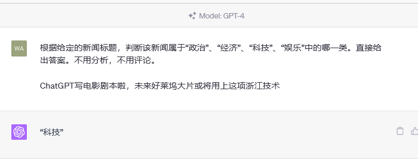

# 大模型应用开发基础

## 💡 这节课会带给你

1. 了解大模型能做什么
2. 整体了解大模型应用开发技术栈
3. 浅尝 OpenAI API 的调用

开始上课！

## 一、怎样学好这门课

1. 课程的设计初心
2. 每次课能给你带来什么
3. 做自己的选择，定自己的目标

### 1.1、我们的初心

我们相信，**懂 AI、懂编程、懂业务**的超级个体，会是 AGI 时代最重要的人。所以我们提出了「AI 全栈工程师」这个概念，让它显得不那么浮夸。

这门课的目标，就是培养「AI 全栈」。

- 「全栈」涉及的知识面非常广，区区一门课不可能全部涉及
- 我们能做到的是，在各个方向上都为大家打开一扇门，带大家入门
- 想走得更深更远，要靠大家自己，我们的社群，和 AI 的进化。

但是，「入门」并不代表简单、肤浅。我们的课程会在三个方向发力：

1. 原理
2. 实践
3. 认知

**不懂原理**就不会举一反三，走不了太远。

**不懂实践**就只能纸上谈兵，做事不落地。

**认知不高**就无法做对决策，天花板太低。

这三样，都是「干货」。

<div class="alert alert-info">
<b>强烈提醒！</b>在剧烈变革的时代，千万别拿代码当干货！整个行业都没有确定性，代码的价值就不大。
</div>

### 1.2、知识体系

在图中找到自己的地盘。


## 1.3、学习方法

我们的职业分布图：


课程内容、难度和进度都是取最大公约数，照顾大多数。典型画像是：

1. 懂至少一门编程语言
2. 有真实的项目经验
3. 对大模型相关技术基本不了解

历史上有三类同学会和课程产生分歧：
| 学员                           | 感受                                 | 建议                                                         |
| ------------------------------ | ------------------------------------ | ------------------------------------------------------------ |
| 没有实际工程经验，甚至不会编程 | 大量听不懂                           | 把能听懂的多实践，凿实。别纠结暂时学不会的，可能只是机缘未到，慢慢来 |
| 已经自学过大模型，甚至实践过   | 有部分内容已知，获得感少             | 关注增量，别被存量绑架                                       |
| 带着项目目标前来               | 课程进度太慢，不能直接解决自己的问题 | 欢迎在群里讨论你的项目                                       |

建议取舍：

1. 原理一定要用心学。除了 Fine-tuning 原理外，都不算难
2. 认知一定要用心领悟。这是这门课最领先的地方
3. 编程和工程经验不足，别对着实战太较劲。受些熏陶就是收获

别忘了，有一年的会员期可以持续跟学！

## 二、什么是 AI？


> 「深蓝」的创造者许峰雄博士说过：「AI is bullshit。深蓝没用任何 AI 算法，就是硬件穷举棋步。」

<div class="alert alert-warning">
<b>思考：</b>你觉得哪些应用算是 AI？
</div>

一种观点：基于机器学习、神经网络的是 AI，基于规则、搜索的不是 AI。

## 三、大模型能干什么？

大模型，全称「大语言模型」，英文「Large Language Model」，缩写「LLM」。

现在，已经不需要再演示了。每人应该都至少和下面一个基于大模型的对话产品，对话过至少 100 次。

| 国家 | 对话产品           | 大模型         | 链接                                                         |
| ---- | ------------------ | -------------- | ------------------------------------------------------------ |
| 美国 | OpenAI ChatGPT     | GPT-3.5、GPT-4 | [https://chat.openai.com/](https://chat.openai.com/)         |
| 美国 | Microsoft Copilot  | GPT-4 和未知   | [https://copilot.microsoft.com/](https://copilot.microsoft.com/) |
| 美国 | Google Bard        | PaLM 和 Gemini | [https://bard.google.com/](https://bard.google.com/)         |
| 中国 | 百度文心一言       | 文心           | [https://yiyan.baidu.com/](https://yiyan.baidu.com/)         |
| 中国 | 讯飞星火           | 星火           | [https://xinghuo.xfyun.cn/](https://xinghuo.xfyun.cn/)       |
| 中国 | 智谱清言           | ChatGLM        | [https://chatglm.cn/](https://chatglm.cn/)                   |
| 中国 | 月之暗面 Kimi Chat | Moonshot       | [https://kimi.moonshot.cn/](https://kimi.moonshot.cn/)       |
| 中国 | MiniMax 星野       | abab           | [https://www.xingyeai.com/](https://www.xingyeai.com/)       |

ChatGPT 已一岁，仍是当家扛把子，别人追赶的对象。

<div class="alert alert-warning">
<b>建议：</b>
<ul>
<li>建议要有一个访问国外的「通道」，否则无法有顶级体验</li>
<li>如果不能访问 ChatGPT，不是 ChatGPT Plus 会员，会非常遗憾</li>
<li><a href="https://copilot.microsoft.com/">Copilot</a>是 ChatGPT 免费平替，用的也是宇宙最强 GPT-4 大模型</li>
</ul>
</div>

注册 ChatGPT、Copilot 教程：https://agiclass.feishu.cn/docx/Jt8ydP0RroFCPaxcWGDcUzVrnnd#YtxodWqgdofsa8xb0GOcaD1nny5

但是，千万别以为大模型只是聊天机器人。它的应用场景，远不止于此。

### 3.1、按格式输出


### 3.2、分类



### 3.3、聚类


### 3.4、持续互动


### 3.5、技术相关问题


### 3.6、更多举例

- **舆情分析：**从公司产品的评论中，分析哪些功能/元素是用户讨论最多的，评价是正向还是负向
- **坐席质检：**检查客服/销售人员与用户的对话记录，判断是否有争吵、辱骂、不当言论，话术是否符合标准
- **故障解释：**根据系统报错信息，给出方便非技术人员阅读的故障说明
- **零代码开发/运维：**自动规划任务，生成指令，自动执行
- **生成业务逻辑：**自定义一套业务描述语言（DSL），直接让 ChatGPT 写业务逻辑代码

<div class="alert alert-warning">
<b>思考：</b>你的业务中，有哪些问题可以用 AI 解决？
</div>

### 3.7、可能一切问题，都能解决，所以是 AGI

<div class="alert alert-success">
<b>划重点：</b>
<ol>
<li>把大模型看做是一个函数，给输入，<b>生成</b>输出</li>
<li>任何业务问题，都可以用语言描述，成为大模型的输入，就能<b>生成</b>业务问题的结果</li>
<li>实际工作中，通常需要将业务任务拆解为若干个子任务，分别解决。<b>理解业务本质，对拆解任务有很大帮助！</b></li>
</ol>
</div>

这是美好的理想，现在还远不能做到

## 四、大模型是怎么生成结果的？

### 4.1、通俗原理

其实，它只是根据上文，猜下一个词（的概率）……


OpenAI 的接口名就叫「completion」，也证明了其只会「生成」的本质。

下面用程序演示「生成下一个字」。你可以自己修改 prompt 试试。还可以使用相同的 prompt 运行多次。

from openai import OpenAI
import os

from dotenv import load_dotenv, find_dotenv
_ = load_dotenv(find_dotenv())

client = OpenAI()

prompt = "今天我很"  # 改我试试
response = client.completions.create(
    model="gpt-3.5-turbo-instruct",
    prompt=prompt,
    max_tokens=20,
    stream=True
)

for chunk in response:
    print(chunk.choices[0].text, end='')
### 4.2、略深一点的通俗原理

<div class="alert alert-success">
<p>用不严密但通俗的语言描述大模型的工作原理：</p>
<ol>
<li>大模型阅读了人类曾说过的所有的话。这就是「<b>机器学习</b>」，这个过程叫「<b>训练</b>」</li>
<li>把一串 token 后面跟着的不同 token 的概率记了下来。记下的就是「<b>参数</b>」，也叫「<b>权重</b>」</li>
<li>当我们给它若干 token，大模型就能算出概率最高的下一个 token 是什么。这就是「<b>生成</b>」，也叫「<b>推理</b>」</li>
<li>用生成的 token，再加上上文，就能继续生成下一个 token。以此类推，生成更多文字</li>
</ol>
</div>

Token 是什么？

1. 可能是一个英文单词，也可能是半个，三分之一个。可能是一个中文词，或者一个汉字，也可能是半个汉字，甚至三分之一个汉字
2. 大模型在开训前，需要先训练一个 tokenizer 模型。它能把所有的文本，切成 token

<div class="alert alert-warning">
<b>思考：</b>
<ol>
<li>AI 做对的事，怎么用这个原理解释？</li>
<li>AI 的幻觉，一本正经地胡说八道，怎么用这个原理解释？</li>
</ol>
</div>

### 4.3、再深一点点

这套生成机制的内核叫「Transformer 架构」。但其实，transformer 已经不是最先进的了。

| 架构        | 设计者                                               | 特点                                     | 链接                                                         |
| ----------- | ---------------------------------------------------- | ---------------------------------------- | ------------------------------------------------------------ |
| Transformer | Google                                               | 最流行，几乎所有大模型都用它             | [OpenAI 的代码](https://github.com/openai/finetune-transformer-lm/blob/master/train.py) |
| RWKV        | [PENG Bo](https://www.zhihu.com/people/bopengbopeng) | 可并行训练，推理性能极佳，适合在端侧使用 | [官网](https://www.rwkv.com/)、[RWKV 5 训练代码](https://github.com/BlinkDL/RWKV-LM/tree/main/RWKV-v5) |
| Mamba       | CMU & Princeton University                           | 性能更佳，尤其适合长文本生成             | [GitHub](https://github.com/state-spaces/mamba)              |

## 五、用好 AI 的核心心法

OpenAI 首席科学家 Ilya Sutskever 说过：

> 数字神经网络和人脑的生物神经网络，在数学原理上是一样的。

所以，我们要：

<div class="alert alert-success">
把 AI 当人看。<br>
把 AI 当人看。<br>
把 AI 当人看。
</div>

我们和凯文·凯利交流时，他说了类似的观点：「和人怎么相处，就和 AI 怎么相处。」

1. 用「当人看」来理解 AI
2. 用「当人看」来控制 AI
3. 用「当人看」来说服用户正确看待 AI 的不足

这是贯彻整门课，甚至我们与 AI 为伴的整个生涯的心法。现在不认同、不理解都没关系，慢慢来。

## 六、大模型应用架构

大模型技术分两个部分：

1. **训练基础大模型**：全世界只需要 1000 人做这个
2. **建造大模型应用**：所有技术人，甚至所有人，都需要掌握

<div class="alert alert-success">
大模型应用技术特点：<strong>门槛低，天花板高。</strong>
</div>

### 6.1、典型业务架构


Agent 还太超前，Copilot 值得追求。

### 6.2、技术架构

#### 纯 Prompt

就像和一个人对话，你说一句，ta 回一句，你再说一句，ta 再回一句……


#### Agent + Function Calling

- Agent：AI 主动提要求
- Function Calling：AI 要求执行某个函数
- 场景举例：你问过年去哪玩，ta 先反问你有几天假


#### RAG = Embeddings + 向量数据库

- Embeddings：把文字转换为更易于相似度计算的编码。这种编码叫向量
- 向量数据库：把向量存起来，方便查找
- 向量搜索：根据输入向量，找到最相似的向量
- 场景举例：考试时，看到一道题，到书上找相关内容，再结合题目组成答案。然后，就都忘了


#### Fine-tuning

努力学习考试内容，长期记住，活学活用。


## 七、编程调用 OpenAI API

官方文档：https://platform.openai.com/docs/api-reference

本课程主要讲 OpenAI 的 GPT 系列大模型的使用，因为：

1. 在天花板上，才能看得够远
2. 其它大模型都在模仿 ta，更容易触类旁通

本课程的主打语言是 Python，因为：

1. Python 和 AI 是天生的一对
2. Python 是最容易学习的编程语言

### 7.1、安装 OpenAI Python 库

在命令行执行：

```bash
pip install --upgrade openai
```

### 7.2、发一条消息

from openai import OpenAI
import os

# 加载 .env 文件到环境变量
from dotenv import load_dotenv, find_dotenv
_ = load_dotenv(find_dotenv())

# 初始化 OpenAI 服务。会自动从环境变量加载 OPENAI_API_KEY 和 OPENAI_BASE_URL
client = OpenAI()

# 消息格式
messages = [
    {
        "role": "system",
        "content": "你是AI助手小瓜，是 AGI 课堂的助教。这门课每周二、四上课。"
    },
    {
        "role": "user",
        "content": "哪天有课？"
    },

]

# 调用 GPT-3.5
chat_completion = client.chat.completions.create(
    model="gpt-3.5-turbo",
    messages=messages
)

# 输出回复
print(chat_completion.choices[0].message.content)
## 彩蛋

我们开发的大模型提效利器：[ChatALL](http://chatall.ai/)。某前端工程师用后表示：「1 小时的调试工作缩短到 5 分钟」。

## 作业

为保证后续课程能正常跟进，请完成如下作业：

1. 能正常使用 ChatGPT 或 Copilot 至少之一
2. 下载安装 [ChatALL](http://chatall.ai/)，通过它体验 ChatGPT 或/和 Bing Chat（Copilot 曾用名）
3. 在 GitHub 给 ChatALL 加个星星（此条自愿 😁）