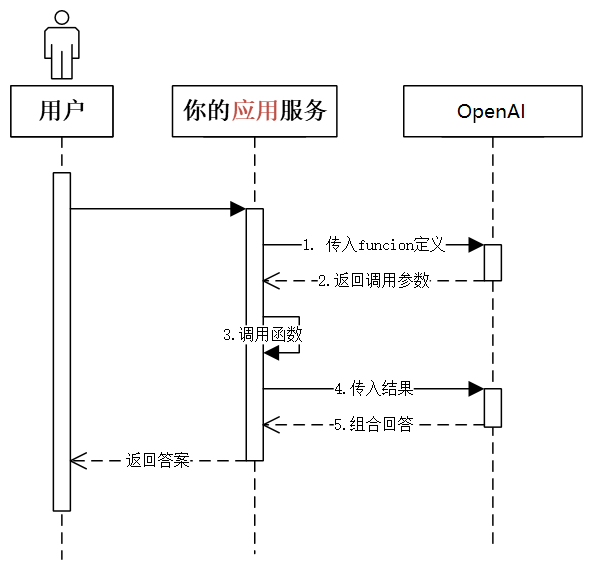

# 用 Function Calling 参与 OpenAI 的创业者灭绝计划

## 💡 这节课会带给你

1. 用自然语言连接系统的认知，面向未来思考系统间的集成问题
2. 通过 OpenAI Tools 等的基本原理和市场表现，对行业格局产生一些感知
3. 掌握 OpenAI Function Calling 连通大模型和现实世界

开始上课！

## 接口（Interface）

两种常见接口：

1. 人机交互接口，User Interface，简称 UI
2. 应用程序编程接口，Application Programming Interface，简称 API

接口能「通」的关键，是两边都要遵守约定。

- 人要按照 UI 的设计来操作。UI 的设计要符合人的习惯
- 程序要按照 API 的设计来调用。API 的设计要符合程序惯例

你是不是有很多调接口的痛苦经历？比如：

- 文档坑
- 大小写坑
- 参数顺序坑
- 参数类型坑
- ……

## 接口的进化

UI:

1. 命令行，Command Line Interface，简称 CLI（DOS、Unix/Linux shell, Windows Power Shell）
2. 图形界面，Graphical User Interface，简称 GUI（Windows、MacOS、iOS、Android）
3. 语言界面，Conversational User Interface，简称 CUI，或 Natural-Language User Interface，简称 LUI ← **我们在这里**
4. 脑机接口，Brain–Computer Interface，简称 BCI


UI 进化的趋势是：越来越适应人的习惯，越来越自然

API：

1. 从本地到远程，从同步到异步，媒介发生很多变化，但本质一直没变：**程序员的约定**
2. 现在，开始进化到自然语言接口，Natural-Language Interface，简称 NLI

## 自然语言连接一切（Natural Language Interface）

NLI 是我们在[《以 ChatGPT 为代表的「大模型」会是多大的技术革命？》](https://mp.weixin.qq.com/s/t0Ml7E-CvlKfdaUMBGKJBg)一文中提出的概念。

> 用户操作习惯的迁移，会逼所有软件，都得提供「自然语言界面（Natural Language Interface，简称 NLI）」。这是我生造的词，指的是以自然语言为输入的接口。
>
> 不仅用户界面要 NLI，API 也要 NLI 化。这是因为用户发出的宏观指令，往往不会是一个独立软件能解决的，它需要很多软件、设备的配合。
>
> 一种实现思路是，入口 AI（比如 Siri、小爱同学，机器人管家）非常强大，能充分了解所有软件和设备的能力，且能准确地把用户任务拆解和分发下去。这对入口 AI 的要求非常高。
>
> 另一种实现思路是，入口 AI 收到自然语言指令，把指令通过 NLI 广播出去（也可以基于某些规则做有选择的广播，保护用户隐私），由各个软件自主决策接不接这个指令，接了要怎么做，该和谁配合。
>
> ……
>
> 当 NLI 成为事实标准，那么互联网上软件、服务的互通性会大幅提升，不再受各种协议、接口的限制。

最自然的接口，就是自然语言接口：

以前因为计算机处理不对自然语言，所以有了那么多编程语言，那么多接口，那么多协议，那么多界面风格。而且，它们每一次进化，都是为了「更自然」。现在，终极的自然，到来了。**我们终于可以把计算机当人看了！**

ChatGPT 让我们体验到 LUI 的美好。而 [Plugins](https://platform.openai.com/docs/plugins/introduction)、[Function Calling](https://platform.openai.com/docs/guides/gpt/function-calling) 到最新发布的 [Actions](https://platform.openai.com/docs/actions) 和 [Assistant API](https://platform.openai.com/docs/assistants/overview)，让我们能直接进入 NLI 的过程。

## Plugins 和 Actions 是什么

学习 plugin 之前，先要了解 ChatGPT 及所有大模型都有两大缺陷：

<div class="alert alert-success">
<b>两大缺陷：</b>
<ol>
<li><b>没有最新信息</b>。大模型的训练周期很长，且更新一次耗资巨大，所以它的知识都是过去的。GPT-3.5 的知识截至 2022 年 1 月，GPT-4 是 2023 年 4 月。</li>
<li><b>没有「真逻辑」</b>。它表现出的逻辑、推理，是训练文本的统计规律，而不是真正的逻辑。</li>
</ol>
<p>所以：大模型需要连接真实世界，并对接真逻辑系统。</p>
</div>

比如算加法：

1. 把 100 以内所有加法算式都训练给大模型，ta 就能回答 100 以内的加法算式
2. 如果问 ta 更大数字的加法，就不一定对了
3. 因为 ta 并不懂「加法」，只是记住了 100 以内的加法算式的统计规律
4. Ta 是用字面意义做数学

Plugin 能一定程度解决这两个问题。

演示：

1. 用天气插件查询天气
2. 用 Wolfram Alpha 插件做数学题

如果你对 Wolfram Alpha 做数学的能力感到惊讶，想了解它和 ChatGPT 原理的不同，推荐阅读这篇文章：[《Wolfram|Alpha as the Way to Bring Computational Knowledge Superpowers to ChatGPT》](https://writings.stephenwolfram.com/2023/01/wolframalpha-as-the-way-to-bring-computational-knowledge-superpowers-to-chatgpt/)

PS. Wolfram 的书《[这就是 ChatGPT！](https://u.jd.com/p8x8bdp)》是从神经网络层面解释大模型原理的最好读的书。[英文版免费](https://writings.stephenwolfram.com/2023/02/what-is-chatgpt-doing-and-why-does-it-work/)

## Plugins/Actions 的工作原理


<div class="alert alert-warning">
<b>思考：</b>它怎么把我们的 Prompt 和插件功能做匹配？
</div>

## Plugins 开发

Plugins 官方文档：https://platform.openai.com/docs/plugins/introduction

Actions 官方文档：https://platform.openai.com/docs/actions

Actions 是 Plugis 的升级，是 GPTs 产品的一部分，但还没有正式推出，目前没有完整参考。所以还是介绍 Plugins。两者[区别](https://platform.openai.com/docs/actions)并不大。

可能是史上最容易开发的 plugin。只需要定义两个文件：

1. `yourdomain.com/.well-known/ai-plugin.json`，描述插件的基本信息
2. `openai.yaml`，描述插件的 API（Swagger 生成的文档）

**而 OpenAI 那边，更简单，没有任何人和你对接。是 AI 和你对接！**AI 阅读上面两个文件，就知道该怎么调用你了。

看个官方例子。

`ai-plugin.json`：

```json
{
  "schema_version": "v1", //配置文件版本
  "name_for_human": "Sport Stats", //插件名字，给用户看的名字
  "name_for_model": "sportStats", //插件名字，给ChatGPT模型看的名字，需要唯一
  "description_for_human": "Get current and historical stats for sport players and games.", //描述插件的功能，这个字段是在插件市场展示给用户看的
  "description_for_model": "Get current and historical stats for sport players and games. Always display results using markdown tables.", //描述插件的功能，ChatGPT会分析这个字段，确定什么时候调用你的插件
  "auth": {
    "type": "none" //这个是API认证方式，none 代表不需要认证
  },
  "api": {
    "type": "openapi",
    "url": "PLUGIN_HOSTNAME/openapi.yaml" //这个是Swagger API文档地址，ChatGPT通过这个地址访问我们的api文档
  },
  "logo_url": "PLUGIN_HOSTNAME/logo.png", //插件logo地址
  "contact_email": "support@example.com", //插件官方联系邮件
  "legal_info_url": "https://example.com/legal" //与该插件相关的legal information
}
```

`openapi.yaml`：

```yaml
openapi: 3.0.1
info:
  title: Sport Stats
  description: Get current and historical stats for sport players and games.
  version: "v1"
servers:
  - url: PLUGIN_HOSTNAME
paths:
  /players:
    get:
      operationId: getPlayers
      summary: Retrieves all players from all seasons whose names match the query string.
      parameters:
        - in: query
          name: query
          schema:
            type: string
          description: Used to filter players based on their name. For example, ?query=davis will return players that have 'davis' in their first or last name.
      responses:
        "200":
          description: OK
  /teams:
    get:
      operationId: getTeams
      summary: Retrieves all teams for the current season.
      responses:
        "200":
          description: OK
  /games:
    get:
      operationId: getGames
      summary: Retrieves all games that match the filters specified by the args. Display results using markdown tables.
      parameters:
        - in: query
          name: limit
          schema:
            type: string
          description: The max number of results to return.
        - in: query
          name: seasons
          schema:
            type: array
            items:
              type: string
          description: Filter by seasons. Seasons are represented by the year they began. For example, 2018 represents season 2018-2019.
        - in: query
          name: team_ids
          schema:
            type: array
            items:
              type: string
          description: Filter by team ids. Team ids can be determined using the getTeams function.
        - in: query
          name: start_date
          schema:
            type: string
          description: A single date in 'YYYY-MM-DD' format. This is used to select games that occur on or after this date.
        - in: query
          name: end_date
          schema:
            type: string
          description: A single date in 'YYYY-MM-DD' format. This is used to select games that occur on or before this date.
      responses:
        "200":
          description: OK
  /stats:
    get:
      operationId: getStats
      summary: Retrieves stats that match the filters specified by the args. Display results using markdown tables.
      parameters:
        - in: query
          name: limit
          schema:
            type: string
          description: The max number of results to return.
        - in: query
          name: player_ids
          schema:
            type: array
            items:
              type: string
          description: Filter by player ids. Player ids can be determined using the getPlayers function.
        - in: query
          name: game_ids
          schema:
            type: array
            items:
              type: string
          description: Filter by game ids. Game ids can be determined using the getGames function.
        - in: query
          name: start_date
          schema:
            type: string
          description: A single date in 'YYYY-MM-DD' format. This is used to select games that occur on or after this date.
        - in: query
          name: end_date
          schema:
            type: string
          description: A single date in 'YYYY-MM-DD' format. This is used to select games that occur on or before this date.
      responses:
        "200":
          description: OK
  /season_averages:
    get:
      operationId: getSeasonAverages
      summary: Retrieves regular season averages for the given players. Display results using markdown tables.
      parameters:
        - in: query
          name: season
          schema:
            type: string
          description: Defaults to the current season. A season is represented by the year it began. For example, 2018 represents season 2018-2019.
        - in: query
          name: player_ids
          schema:
            type: array
            items:
              type: string
          description: Filter by player ids. Player ids can be determined using the getPlayers function.
      responses:
        "200":
          description: OK
```

`description` 的内容非常重要，决定了 ChatGPT 会不会调用你的插件，调用得是否正确。

<div class="alert alert-warning">
<b>思考：</b>为什么不干脆整个描述文件都用自然语言写？非要用结构化的 JSON 和 YAML？
</div>

## Plugins 的市场表现

1. 时间线：
   1. 3 月 24 日发布， 提供 11 个插件，可以申请加入 waitlist 获得使用权
   2. 5 月 15 日开始向 Plus 用户全量开放插件和 Browsing， 插件数 70 多个
   3. 7 月 5 日因安全原因，关闭 Browsing（用户可通过此功能访问付费页面）
   4. 7 月 11 日开始全量开放 Code Interpreter。插件数已超 400
   5. 11 月 6 日，1039 个
2. 媒体将其类比为 App Store，获得鼓吹
3. 6 月 7 日（全面放开后三星期）一篇应 OpenAI 要求而[被删除的帖子](https://humanloop.com/blog/openai-plans)中透露，Sam Altman 在一个闭门会中说：「插件的实际使用情况表明，除了 Browsing 以外，还没有达到理想的产品市场契合点。他表示，**很多人认为他们希望自己的应用程序位于 ChatGPT 中，但他们真正想要的是应用程序中的 ChatGPT**。」（被删内容这里可以看到：https://web.archive.org/web/20230531203946/https://humanloop.com/blog/openai-plans）

<div class="alert alert-warning">
<b>思考：</b>未来使用 AI 的入口，是有类似 ChatGPT 这样的超级入口，还是每个场景都有自己的 AI 入口（比如 WPS AI、钉钉魔法棒、微软 Copilot）？
</div>

## Plugins 失败分析和 GPTs 的未来

Plugins 歇菜了，主要原因：

1. 缺少「强 Agent」调度，只能手工选三个 plugin，使用成本太高。（解决此问题，相当于 App Store + Siri，可挑战手机操作系统地位）
2. 不在「场景」中，不能提供端到端一揽子服务。（解决此问题，就是全能私人助理了，人类唯一需要的软件）
3. 开销大。（至少两次 GPT-4 生成，和一次 Web API 调用）

注意：这是我们做「智能应用」也要面对的问题。

[GPTs](https://openai.com/blog/introducing-gpts) 这样解决问题：

1. 每个 GPT 有一个场景，比如「写代码」「教小孩数学」「做个嘤嘤怪」「某某人的化身」
2. 被 GPT 绑定的 Actions 被自动调用，缩小了 agent 调度的难度
3. GPT-4 提速又降价

做为开发者，我们：

1. 可以开发 Actions，搭建自己的 GPTs
2. 还可以使用 [Assistants API](https://platform.openai.com/docs/assistants/overview)，脱离 ChatGPT 做独立智能应用

做独立智能应用，需要先了解 Function Calling。

## Function Calling 的机制



Function Calling 完整的官方接口文档：https://platform.openai.com/docs/guides/gpt/function-calling

值得一提：OpenAI 今天在接口里废掉了 `functions` 这个名字，换成了 `tools`。这是一个很有趣的指向

## 示例 1：调用本地函数

需求：实现一个回答问题的 AI。题目中如果有加法，必须能精确计算。

```python
# 加载环境变量

from openai import OpenAI
from dotenv import load_dotenv, find_dotenv
import openai
import os
import json

_ = load_dotenv(find_dotenv())  # 读取本地 .env 文件，里面定义了 OPENAI_API_KEY


client = OpenAI(
    api_key=os.getenv("OPENAI_API_KEY"),
    base_url=os.getenv("OPENAI_BASE_URL")
)
```

```python
def get_completion(messages, model="gpt-3.5-turbo-1106"):
    response = client.chat.completions.create(  # 注意，以前的 client.ChatCompletion 要换成 client.chat.completions
        model=model,
        messages=messages,
        temperature=0.7,  # 模型输出的随机性，0 表示随机性最小
        tools=[{  # 用 JSON 描述函数。可以定义多个。由大模型决定调用谁。也可能都不调用
            "type": "function",
            "function": {
                "name": "sum",
                "description": "加法器，计算一组数的和",
                "parameters": {
                    "type": "object",
                    "properties": {
                        "numbers": {
                            "type": "array",
                            "items": {
                                "type": "number"
                            }
                        }
                    }
                }
            }
        }],
    )
    return response.choices[0].message
```

```python
from math import *

prompt = "Tell me the sum of 1, 2, 3, 4, 5, 6, 7, 8, 9, 10."

# prompt = "桌上有 2 个苹果，四个桃子和 3 本书，一共有几个水果？"

# prompt = "1+2+3...+99+100"

# prompt = "1024 乘以 1024 是多少？"  # Tools 里没有定义乘法，会怎样？

# prompt = "太阳从哪边升起？"   # 不需要算加法，会怎样？

messages = [
    {"role": "system", "content": "你是一个小学数学老师，你要教学生加法"},
    {"role": "user", "content": prompt}
]
response = get_completion(messages)

# 把大模型的回复加入到对话历史中

if (response.content is None):  # 解决 OpenAI 的一个 400 bug
    response.content = ""
print(response)
messages.append(response)

print("=====GPT回复=====")
print(response)

# 如果返回的是函数调用结果，则打印出来

if (response.tool_calls is not None):
    # 是否要调用 sum
    tool_call = response.tool_calls[0]
    if (tool_call.function.name == "sum"):
        # 调用 sum
        args = json.loads(tool_call.function.arguments)
        result = sum(args["numbers"])
        print("=====函数返回=====")
        print(result)

    # 把函数调用结果加入到对话历史中

​    messages.append(
​        {
​            "tool_call_id": tool_call.id,  # 用于标识函数调用的 ID
​            "role": "tool",
​            "name": "sum",
​            "content": str(result)  # 数值result 必须转成字符串
​        }
​    )

    # 再次调用大模型

​    print("=====最终回复=====")
​    print(get_completion(messages).content)
```


## 示例 2：代码套代码

需求：可以算任意数学表达式

```python
def get_completion(messages, model="gpt-3.5-turbo-1106"):
    response = client.chat.completions.create(
        model=model,
        messages=messages,
        temperature=0,  # 模型输出的随机性，0 表示随机性最小
        tools=[{
            "type": "function",
            "function": {
                "name": "calculate",
                "description": "计算一个数学表达式的值",
                "parameters": {
                    "type": "object",
                    "properties": {
                        "expression": {
                            "type": "string",
                            "description": "a mathematical expression in python grammar.",
                        }
                    }
                }
            }
        }],
    )
    return response.choices[0].message
```

from math import *

prompt = "从1加到10"
# prompt = "3的平方根乘以2再开平方"

messages = [
    {"role": "system", "content": "你是一个数学家，你可以计算任何算式。"},
    {"role": "user", "content": prompt}
]
response = get_completion(messages)
if (response.content is None):  # 解决 OpenAI 的一个 400 bug
    response.content = ""
messages.append(response)  # 把大模型的回复加入到对话中
print("=====GPT回复=====")
print(response)

# 如果返回的是函数调用结果，则打印出来
```python
if (response.tool_calls is not None):

    # 是否要调用 sum

​    tool_call = response.tool_calls[0]
​    if (tool_call.function.name == "calculate"):

        # 调用 sum

​        args = json.loads(tool_call.function.arguments)
​        result = eval(args["expression"])
​        print("=====函数返回=====")
​        print(result)

    # 把函数调用结果加入到对话历史中

​    messages.append(
​        {
​            "tool_call_id": tool_call.id,  # 用于标识函数调用的 ID
​            "role": "tool",
​            "name": "sum",
​            "content": str(result)  # 数值result 必须转成字符串
​        }
​    )

    # 再次调用大模型

​    print("=====最终回复=====")
​    print(get_completion(messages).content)
```


<div class="alert alert-success">
<b>划重点：</b>
<ol>
<li>Function Calling 中的函数与参数的描述也是一种 Prompt</li>
<li>这种 Prompt 也需要调优，否则会影响函数的召回、参数的准确性，甚至让 GPT 产生幻觉</li>
</ol>
</div>

## 示例 4：远程/多 Function 调用

```python
def get_completion(messages, model="gpt-3.5-turbo-1106"):
    response = client.chat.completions.create(
        model=model,
        messages=messages,
        temperature=0,  # 模型输出的随机性，0 表示随机性最小
        seed=1024,  # 随机种子保持不变，temperature 和 prompt 不变的情况下，输出就会不变
        tool_choice="auto",  # 默认值，由系统自动决定，返回function call还是返回文字回复
        tools=[{
            "type": "function",
            "function": {

​            "name": "get_location_coordinate",
​            "description": "根据POI名称，获得POI的经纬度坐标",
​            "parameters": {
​                "type": "object",
​                "properties": {
​                    "location": {
​                        "type": "string",
​                        "description": "POI名称，必须是中文",
​                    },
​                    "city": {
​                        "type": "string",
​                        "description": "POI所在的城市名，必须是中文",
​                    }
​                },
​                "required": ["location", "city"],
​            }
​        }
​    },
​        {
​        "type": "function",
​        "function": {
​            "name": "search_nearby_pois",
​            "description": "搜索给定坐标附近的poi",
​            "parameters": {
​                "type": "object",
​                "properties": {
​                    "longitude": {
​                        "type": "string",
​                        "description": "中心点的经度",
​                    },
​                    "latitude": {
​                        "type": "string",
​                        "description": "中心点的纬度",
​                    },
​                    "keyword": {
​                        "type": "string",
​                        "description": "目标poi的关键字",
​                    }
​                },
​                "required": ["longitude", "latitude", "keyword"],
​            }
​        }
​    }],
)
return response.choices[0].message
```

```python
import requests

amap_key = "6d672e6194caa3b639fccf2caf06c342"

def get_location_coordinate(location, city="北京"):
    url = f"https://restapi.amap.com/v5/place/text?key={amap_key}&keywords={location}&region={city}"
    print(url)
    r = requests.get(url)
    result = r.json()
    if "pois" in result and result["pois"]:
        return result["pois"][0]
    return None


def search_nearby_pois(longitude, latitude, keyword):
    url = f"https://restapi.amap.com/v5/place/around?key={amap_key}&keywords={keyword}&location={longitude},{latitude}"
    print(url)
    r = requests.get(url)
    result = r.json()
    ans = ""
    if "pois" in result and result["pois"]:
        for i in range(min(3, len(result["pois"]))):
            name = result["pois"][i]["name"]
            address = result["pois"][i]["address"]
            distance = result["pois"][i]["distance"]
            ans += f"{name}\n{address}\n距离：{distance}米\n\n"
    return ans
```

```python
prompt = "北京三里屯附近的咖啡"

messages = [
    {"role": "system", "content": "你是一个地图通，你可以找到任何地址。"},
    {"role": "user", "content": prompt}
]
response = get_completion(messages)
if (response.content is None):  # 解决 OpenAI 的一个 400 bug
    response.content = ""
messages.append(response)  # 把大模型的回复加入到对话中
print("=====GPT回复=====")
print(response)

# 如果返回的是函数调用结果，则打印出来

while (response.tool_calls is not None):
    # 1106 版新模型支持一次返回多个函数调用请求
    for tool_call in response.tool_calls:
        args = json.loads(tool_call.function.arguments)
        print(args)

        if (tool_call.function.name == "get_location_coordinate"):
            print("Call: get_location_coordinate")
            result = get_location_coordinate(**args)
        elif (tool_call.function.name == "search_nearby_pois"):
            print("Call: search_nearby_pois")
            result = search_nearby_pois(**args)
    
        print("=====函数返回=====")
        print(result)
    
        messages.append({
            "tool_call_id": tool_call.id,  # 用于标识函数调用的 ID
            "role": "tool",
            "name": tool_call.function.name,
            "content": str(result)  # 数值result 必须转成字符串
        })
    
    response = get_completion(messages)
    if (response.content is None):  # 解决 OpenAI 的一个 400 bug
        response.content = ""
    messages.append(response)  # 把大模型的回复加入到对话中

print("=====最终回复=====")
print(response.content)
```


## 示例 5：用 Function Calling 获取 JSON 结构

回忆第一课中的例子：从一段文字中抽取联系人姓名、地址和电话

```python
def get_completion(messages, model="gpt-3.5-turbo-1106"):
    response = client.chat.completions.create(
        model=model,
        messages=messages,
        temperature=0,  # 模型输出的随机性，0 表示随机性最小
        tools=[{
            "type": "function",
            "function": {
                "name": "add_contact",
                "description": "添加联系人",
                "parameters": {
                    "type": "object",
                    "properties": {
                        "name": {
                            "type": "string",
                            "description": "联系人姓名"
                        },
                        "address": {
                            "type": "string",
                            "description": "联系人地址"
                        },
                        "tel": {
                            "type": "string",
                            "description": "联系人电话"
                        },
                    }
                }
            }
        }],
    )
    return response.choices[0].message


prompt = "帮我寄给王卓然，地址是北京市朝阳区亮马桥外交办公大楼，电话13012345678。"
messages = [
    {"role": "system", "content": "你是一个联系人录入员。"},
    {"role": "user", "content": prompt}
]
response = get_completion(messages)
print("====GPT回复====")
print(response)
args = json.loads(response.tool_calls[0].function.arguments)
print("====函数参数====")
print(args)
```


<div class="alert alert-success">
不过，最好的提取 JSON 的方式，是用最新的 <a href="https://platform.openai.com/docs/guides/text-generation/json-mode">JSON Mode</a>
</div>

## 示例 6：通过 Function Calling 查询数据库

需求：从订单表中查询各种信息，比如某个用户的订单数量、某个商品的销量、某个用户的消费总额等等。

```python
from openai import OpenAI
import os
import json

from dotenv import load_dotenv, find_dotenv
_ = load_dotenv(find_dotenv())  # 读取本地 .env 文件，里面定义了 OPENAI_API_KEY

client = OpenAI(
    api_key=os.getenv("OPENAI_API_KEY"),
    base_url=os.getenv("OPENAI_BASE_URL")
)


def get_sql_completion(messages, model="gpt-3.5-turbo-1106"):
    response = client.chat.completions.create(
        model=model,
        messages=messages,
        temperature=0,  # 模型输出的随机性，0 表示随机性最小
        tools=[{  # 摘自 OpenAI 官方示例 https://github.com/openai/openai-cookbook/blob/main/examples/How_to_call_functions_with_chat_models.ipynb
            "type": "function",
            "function": {
                "name": "ask_database",
                "description": "Use this function to answer user questions about business. \
                            Output should be a fully formed SQL query.",
                "parameters": {
                    "type": "object",
                    "properties": {
                        "query": {
                            "type": "string",
                            "description": f"""
                            SQL query extracting info to answer the user's question.
                            SQL should be written using this database schema:
                            {database_schema_string}
                            The query should be returned in plain text, not in JSON.
                            The query should only contain grammars supported by SQLite.
                            """,
                        }
                    },
                    "required": ["query"],
                }
            }
        }],
    )
    return response.choices[0].message
```


```python
#  描述数据库表结构

database_schema_string = """
CREATE TABLE orders (
    id INT PRIMARY KEY NOT NULL, -- 主键，不允许为空
    customer_id INT NOT NULL, -- 客户ID，不允许为空
    product_id STR NOT NULL, -- 产品ID，不允许为空
    price DECIMAL(10,2) NOT NULL, -- 价格，不允许为空
    status INT NOT NULL, -- 订单状态，整数类型，不允许为空。0代表待支付，1代表已支付，2代表已退款
    create_time TIMESTAMP DEFAULT CURRENT_TIMESTAMP, -- 创建时间，默认为当前时间
    pay_time TIMESTAMP -- 支付时间，可以为空
);
"""
```

```python
import sqlite3

# 创建数据库连接

conn = sqlite3.connect(':memory:')
cursor = conn.cursor()

# 创建orders表

cursor.execute(database_schema_string)

# 插入5条明确的模拟记录

mock_data = [
    (1, 1001, 'TSHIRT_1', 50.00, 0, '2023-10-12 10:00:00', None),
    (2, 1001, 'TSHIRT_2', 75.50, 1, '2023-10-16 11:00:00', '2023-08-16 12:00:00'),
    (3, 1002, 'SHOES_X2', 25.25, 2, '2023-10-17 12:30:00', '2023-08-17 13:00:00'),
    (4, 1003, 'HAT_Z112', 60.75, 1, '2023-10-20 14:00:00', '2023-08-20 15:00:00'),
    (5, 1002, 'WATCH_X001', 90.00, 0, '2023-10-28 16:00:00', None)
]

for record in mock_data:
    cursor.execute('''
    INSERT INTO orders (id, customer_id, product_id, price, status, create_time, pay_time)
    VALUES (?, ?, ?, ?, ?, ?, ?)
    ''', record)

# 提交事务

conn.commit()
```

```python
def ask_database(query):
    cursor.execute(query)
    records = cursor.fetchall()
    return records


prompt = "上个月的销售额"

# prompt = "统计每月每件商品的销售额"

# prompt = "哪个用户消费最高？消费多少？"

messages = [
    {"role": "system", "content": "基于 order 表回答用户问题"},
    {"role": "user", "content": prompt}
]
response = get_sql_completion(messages)
if response.content is None:
    response.content = ""
messages.append(response)
print("====Function Calling====")
print(response)

if response.tool_calls is not None:
    tool_call = response.tool_calls[0]
    if tool_call.function.name == "ask_database":
        arguments = tool_call.function.arguments
        args = json.loads(arguments)
        print("====SQL====")
        print(args["query"])
        result = ask_database(args["query"])
        print("====DB Records====")
        print(result)

​    messages.append({
​        "tool_call_id": tool_call.id,
​        "role": "tool",
​        "name": "ask_database",
​        "content": str(result)
​    })
​    response = get_sql_completion(messages)
​    print("====最终回复====")
​    print(response.content)
```


<div class="alert alert-info">
<b>作业：</b>尝试用Function Calling的方式实现第二课手机中流量包智能客服的例子
</div>

## 示例 7：用 Function Calling 实现多表查询

```python
#  描述数据库表结构

database_schema_string = """
CREATE TABLE customers (
    id INT PRIMARY KEY NOT NULL, -- 主键，不允许为空
    customer_name VARCHAR(255) NOT NULL, -- 客户名，不允许为空
    email VARCHAR(255) UNIQUE, -- 邮箱，唯一
    register_time TIMESTAMP DEFAULT CURRENT_TIMESTAMP -- 注册时间，默认为当前时间
);
CREATE TABLE products (
    id INT PRIMARY KEY NOT NULL, -- 主键，不允许为空
    product_name VARCHAR(255) NOT NULL, -- 产品名称，不允许为空
    price DECIMAL(10,2) NOT NULL -- 价格，不允许为空
);
CREATE TABLE orders (
    id INT PRIMARY KEY NOT NULL, -- 主键，不允许为空
    customer_id INT NOT NULL, -- 客户ID，不允许为空
    product_id INT NOT NULL, -- 产品ID，不允许为空
    price DECIMAL(10,2) NOT NULL, -- 价格，不允许为空
    status INT NOT NULL, -- 订单状态，整数类型，不允许为空。0代表待支付，1代表已支付，2代表已退款
    create_time TIMESTAMP DEFAULT CURRENT_TIMESTAMP, -- 创建时间，默认为当前时间
    pay_time TIMESTAMP -- 支付时间，可以为空
);
"""

prompt = "统计每月每件商品的销售额"

# prompt = "这星期消费最高的用户是谁？他买了哪些商品？ 每件商品买了几件？花费多少？"

messages = [
    {"role": "system", "content": "基于 order 表回答用户问题"},
    {"role": "user", "content": prompt}
]
response = get_sql_completion(messages)
print(response)
```


## Function Calling 的注意事项

<div class="alert alert-success">
<b>划重点：</b>
<ol>
<li>只有 `gpt-3.5-turbo-1106` 和 `gpt-4-1106-preview` 可用本次课介绍的方法</li>
<li>OpenAI 针对 Function Calling 做了 fine-tuning，以尽可能保证正确率。机理后面课时会讲</li>
<li>但不保证不出错，包括不保证 json 格式正确。所以官方强烈建议（原文：strongly recommend）如果有对真实世界会产生影响的操作，一定插入人工流程做确认。但比纯靠 prompt 控制，可靠性是大了很多的</li>
<li>函数声明是消耗 token 的。要在功能覆盖、省钱、节约上下文窗口之间找到最佳平衡</li>
</ol>
</div>

## 支持 Function Calling 的国产大模型

Function Calling 会成为所有大模型的标配，虽然现在支持的还不多。

### 百度文心大模型

官方文档：https://cloud.baidu.com/doc/WENXINWORKSHOP/index.html

百度文心系列大模型有三个。按发布时间从早到晚是：

1. ERNIE-Bot - 支持 Function Calling
2. ERNIE-Bot-turbo
3. ERNIE-Bot 4.0 - 支持 Function Calling（暂时白名单制）

从价格看区别：


Function Calling 的 API 和 OpenAI 1106 之前版本完全一样。

### MiniMax

官方文档：https://api.minimax.chat/document/guides/chat-pro?id=64b79fa3e74cddc5215939f4

- 这是个公众不大知道，但其实挺强的大模型，尤其角色扮演能力
- 如果你曾经在一个叫 GLow 的 app 流连忘返，那么你已经用过它了
- 应该是最早支持 Function Calling 的国产大模型
- Function Calling 的 API 和 OpenAI 1106 版之前完全一样，但其它 API 有很大的特色

### ChatGLM3-6B

官方文档：https://github.com/THUDM/ChatGLM3/blob/main/tool_using/README.md

- 最著名的国产开源大模型，生态最好
- 早就使用 `tools` 而不是 `function` 来做参数，其它和 OpenAI 1106 版之前完全一样

### 讯飞星火 3.0

官方文档：https://www.xfyun.cn/doc/spark/Web.html#_2-function-call%E8%AF%B4%E6%98%8E

和 OpenAI 1106 版之前完全一样

## Function Calling 的想象空间

想象你是下面产品的研发，怎样用 Function Calling 实现下面的功能？

1. 对着微信说：「给我每个好友发一条情真意切的拜年消息，还要带点儿小幽默」
2. 对着富途牛牛说：「人工智能相关股票，市盈率最低的是哪几个？最近交易量如何？都有哪些机构持有？」
3. 对着京东说：「我想买一台 65 寸的电视，不要日货，价格在 5000 元左右」

基本上：

1. 我们的任何功能都可以和大模型结合，提供更好的用户体验
2. 通过大模型，完成内部功能的组合调用，完全 agent 化设计系统架构

当然，「幻觉」仍然是存在的。如何尽量减少幻觉的影响，参考以下资料：

- 自然语言生成中关于幻觉研究的综述：https://arxiv.org/abs/2202.03629
- 语言模型出现的幻觉是如何滚雪球的：https://arxiv.org/abs/2305.13534
- ChatGPT 在推理、幻觉和交互性上的评估：https://arxiv.org/abs/2302.04023
- 对比学习减少对话中的幻觉：https://arxiv.org/abs/2212.10400
- 自洽性提高了语言模型的思维链推理能力：https://arxiv.org/abs/2203.11171
- 生成式大型语言模型的黑盒幻觉检测：https://arxiv.org/abs/2303.08896

<div class="alert alert-success">
<b>NLP算法工程师视角：</b>
<ol>
<li>模型砍大面，规则修细节</li>
<li>一个模型搞不定的问题，拆成多个解决</li>
<li>评估算法的准确率（所以要先有测试集，否则别问「能不能做」）</li>
<li>评估 bad case 的影响面</li>
<li>算法的结果永远不是100%正确的，建立在这个假设基础上推敲产品的可行性</li>
</ol>
</div>

## Assistants API 让一切更简单了

官方文档：https://platform.openai.com/docs/assistants/overview

这套东西我们还没玩透（毕竟只有一个白天），现在就简单演示下，后面再深入。

下面是前面示例 4 的 Assistants API 实现

```python
from anyio import sleep
from openai import OpenAI
import os
import json
import requests

from dotenv import load_dotenv, find_dotenv
_ = load_dotenv(find_dotenv())  # 读取本地 .env 文件，里面定义了 OPENAI_API_KEY


# 定义高德地图API的key

amap_key = "6d672e6194caa3b639fccf2caf06c342"

# 定义本地函数


def get_location_coordinate(location, city="北京"):
    url = f"https://restapi.amap.com/v5/place/text?key={amap_key}&keywords={location}&region={city}"
    print(url)
    r = requests.get(url)
    result = r.json()
    if "pois" in result and result["pois"]:
        return result["pois"][0]
    return None


def search_nearby_pois(longitude, latitude, keyword):
    url = f"https://restapi.amap.com/v5/place/around?key={amap_key}&keywords={keyword}&location={longitude},{latitude}"
    print(url)
    r = requests.get(url)
    result = r.json()
    ans = ""
    if "pois" in result and result["pois"]:
        for i in range(min(3, len(result["pois"]))):
            name = result["pois"][i]["name"]
            address = result["pois"][i]["address"]
            distance = result["pois"][i]["distance"]
            ans += f"{name}\n{address}\n距离：{distance}米\n\n"
    return ans


# 初始化 OpenAI 服务

client = OpenAI(
    api_key=os.getenv("OPENAI_API_KEY"),
    base_url=os.getenv("OPENAI_BASE_URL")
)

# 创建助手。此时不会执行任务

assistant = client.beta.assistants.create(
    name="导游",
    description="你是一个地图通，你可以找到任何地址。",
    model="gpt-3.5-turbo-1106",
    tools=[{
        "type": "function",
        "function": {
            "name": "get_location_coordinate",
            "description": "根据POI名称，获得POI的经纬度坐标",
            "parameters": {
                "type": "object",
                "properties": {
                    "location": {
                        "type": "string",
                        "description": "POI名称，必须是中文",
                    },
                    "city": {
                        "type": "string",
                        "description": "POI所在的城市名，必须是中文",
                    }
                },
                "required": ["location", "city"],
            }
        }
    },
        {
        "type": "function",
        "function": {
            "name": "search_nearby_pois",
            "description": "搜索给定坐标附近的poi",
            "parameters": {
                "type": "object",
                "properties": {
                    "longitude": {
                        "type": "string",
                        "description": "中心点的经度",
                    },
                    "latitude": {
                        "type": "string",
                        "description": "中心点的纬度",
                    },
                    "keyword": {
                        "type": "string",
                        "description": "目标poi的关键字",
                    }
                },
                "required": ["longitude", "latitude", "keyword"],
            }
        }
    }],
)

print("----assistant----")
print(assistant)

# 创建对话

thread = client.beta.threads.create(
    messages=[{
        "role": "user",
        "content": "北京三里屯附近的咖啡"
    }]
)

# 执行任务

run = client.beta.threads.runs.create(
    thread_id=thread.id,
    assistant_id=assistant.id)

print("----run----")
print(run)

while (True):
    print(run.status)
    if (run.status == "completed"):
        print("completed")
        messages = client.beta.threads.messages.list(thread_id=thread.id)
        print(messages.data[0].content[0].text.value)
        break
    elif (run.status == "failed"):
        print("failed")
        break
    elif (run.status == "queued"):
        print("queued")
        sleep(1000)
        run = client.beta.threads.runs.retrieve(
            thread_id=thread.id, run_id=run.id)
        continue
    elif (run.status == "requires_action"):
        require_action = run.required_action
        print(require_action)

        output = []
    
        for submit_tool in require_action.submit_tool_outputs.tool_calls:
            print("=======Submit Tool=======")
            print(submit_tool)
            if (submit_tool.function.name == "get_location_coordinate"):
                # )#["arguments"])
                args = json.loads(submit_tool.function.arguments)
                print("Call: get_location_coordinate")
                result = get_location_coordinate(**args)
                output.append(
                    {"output": result, "tool_call_id": submit_tool.id})
            elif (submit_tool.function.name == "search_nearby_pois"):
                # json.loads(response["function_call"]["arguments"])
                args = json.loads(submit_tool.function.arguments)
                print("Call: search_nearby_pois")
                result = search_nearby_pois(**args)
                output.append(
                    {"output": result, "tool_call_id": submit_tool.id})
    
            run = client.beta.threads.runs.submit_tool_outputs(
                thread_id=thread.id, run_id=run.id,
                tool_outputs=output
            )
    elif (run.status == "in_progress"):
        sleep(1000)
        run = client.beta.threads.runs.retrieve(
            thread_id=thread.id, run_id=run.id)
        continue
    else:
        print("unknown status")
        break

# client.beta.threads.delete(thread_id=thread.id)

# client.beta.assistants.delete(assistant_id=assistant.id)
```

用你自己的 API key 运行后，可在 https://platform.openai.com/assistants 和 https://platform.openai.com/threads 查看到历史

## 开发技巧分享：在 Stream 模式下使用 Function Calling

```python
def get_completion(messages, model="gpt-3.5-turbo-1106"):
    response = client.chat.completions.create(
        model=model,
        messages=messages,
        temperature=0,  # 模型输出的随机性，0 表示随机性最小
        tools=[{
            "type": "function",
            "function": {
                "name": "sum",
                "description": "计算一组数的加和",
                "parameters": {
                    "type": "object",
                    "properties": {
                        "numbers": {
                            "type": "array",
                            "items": {
                                "type": "number"
                            }
                        }
                    }
                }
            }
        }],
        stream=True,
    )
    return response


prompt = "1+2+3"

# prompt = "你是谁"

messages = [
    {"role": "system", "content": "你是一个小学数学老师，你要教学生加法"},
    {"role": "user", "content": prompt}
]
response = get_completion(messages)

function_name, args, text = "", "", ""

print("====Streaming====")

# 需要把 stream 里的 token 拼起来，才能得到完整的 call

for msg in response:
    delta = msg.choices[0].delta
    if delta.tool_calls:
        if not function_name:
            function_name = delta.tool_calls[0].function.name
        args_delta = delta.tool_calls[0].function.arguments
        print(args_delta)
        args = args + args_delta
    elif delta.content:
        text_delta = delta.content
        print(text_delta)
        text = text + text_delta

print("====done!====")

if function_name or args:
    print(function_name)
    print(args)
if text:
    print(text)
```


## 彩蛋

第一期同学/现任助教「拐爷&&老拐瘦」可能是国内最早在真实业务里落地 Function Calling 的人。

本节课从他的经验中吸取了不少营养，特此致谢。下面是它的产品 demo 视频:

<video src="./demo.mp4" controls="controls" width=600px style="margin-left: 0px"></video>

**产品链接：https://assistant.kattgatt.com/**


## 作业

针对你公司数据库中的某个或某几个表，写一个程序，从自然语言生成查询他们的 SQL。

也大胆试试写数据库？出了问题，可不怪 AGI 课堂哦。